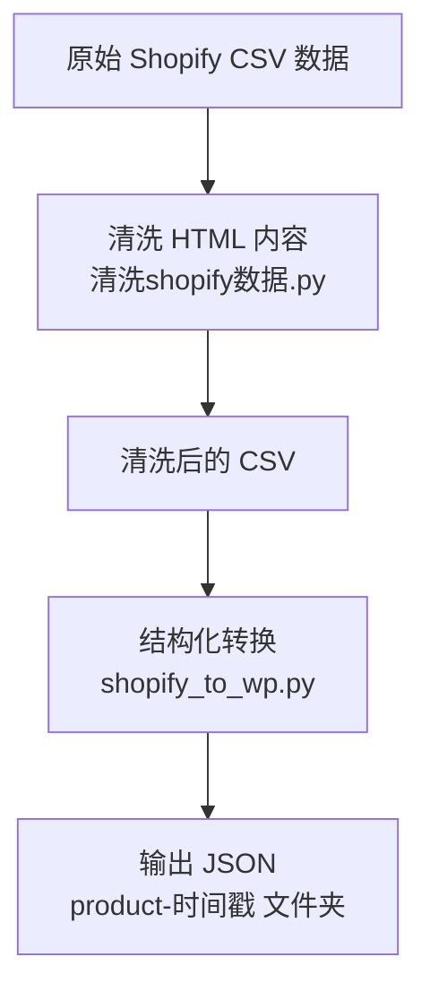

# Shopify 数据清洗与转换工具

本项目包含两个 Python 脚本，帮助你高效地清洗、转换 Shopify 导出的产品数据，适用于批量迁移、数据分析等场景。

---

## 功能简介

- **清洗shopify数据.py**
  - 批量清理 CSV 文件中产品描述（Body (HTML)）的多余 HTML 标签、注释、脚本等内容。
  - 支持自定义文本替换、区间删除、字符截断。
  - 只处理 `Body (HTML)` 列，其他数据保持不变。

- **shopify_to_wp.py**
  - 将清洗后的 CSV 转换为结构化 JSON 文件，适配 WordPress/WooCommerce 等平台。
  - 每个产品仅保留图片（position>=1）的后5张，并重新编号。
  - 每次处理结果自动保存在以 `product-时间戳` 命名的文件夹，便于版本管理。

---

## 使用流程



---

## 快速开始

1. **安装依赖**

   ```bash
   pip install pandas beautifulsoup4 python-slugify
   ```

2. **清洗 CSV 文件**

   将待处理的 CSV 文件放在脚本同目录下，运行：

   ```bash
   python 清洗shopify数据.py
   ```
   - 只处理 `Body (HTML)` 列，自动覆盖原文件（建议提前备份）。

3. **转换为 JSON**

   ```bash
   python shopify_to_wp.py
   ```
   - 处理所有 `.csv` 文件，输出到 `product-时间戳` 文件夹。
   - 每个产品只保留后5张图片（不含主图），图片序号重排。

---

## 主要参数与自定义

- **清洗shopify数据.py**
  - 可自定义文本替换、区间删除、字符删除，详见脚本内配置。
- **shopify_to_wp.py**
  - 输出文件夹自动按时间戳命名，无需手动设置。

---

## 目录结构示例

```
├── 清洗shopify数据.py
├── shopify_to_wp.py
├── products/                # 历史输出（可选）
├── product-20240709123456/  # 每次运行自动生成
│   ├── all_products_xxx.json
│   └── ...
├── all_products_xxx.csv     # 原始/清洗后CSV
└── README.md
```

---

## License

MIT
